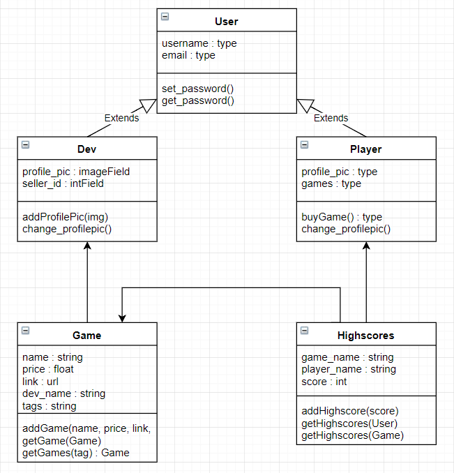

Leo Kivikunnas 525925

Jaakko Koskela 526050

Henri-Matias Tuomaala 609265

# wsd18 project
## General description
An online game store for JavaScript games. The service has two types of users: players and developers. Developers can add their games to the service and set a price for it. Players can buy games on the platform and then play purchased games online.

We plan on implementing all the mandatory features. Additionally we plan on implementing 3rd Party login, RESTful API and our own game.

Authentication will be implemented using Django auth. The site will have email validation after registration.

We are going to implement basic player functionalities: Players are able to search for games and buy them using Simple Payments. Players are able to play games that they have purchased. Our app adds the name of the game to players games-list when player buys the game from the website. Basic search functionality will be implemented in order for players to find games to buy.

Developers are able to add and manage their own games on the site and set a price for them. Basic security, inventory and statics will be implemented inside the dev.py model.

Game/service interactions will be implemented using postMessage as requested. We will keep track of highscores and each players game states with appropriate models.

For additional features, the 3rd party login will use Google. The RESTful API will provide a list of the available games in our site in a JSON format. Our own game will be a platformer in the style of Super Mario.

## Models
1. User (username PRIMARY KEY, email, etc.), already found in django
2. Player (profile_pic, owned_games), inherits the User model
3. Dev (profile_pic, seller_id), inherits the User model

4. Game (name PRIMARY KEY, dev FOREIGN KEY, price, link, purchases, tags)
5. Highscores (game FOREIGN KEY, user FOREIGNKEY, score)

There can be multiple highscores associated with one game and also multiple highscores associated with one player, but a single user can have only one highscore per game. This can be achieved, for example, by setting the username and game_name unigue together in model meta options.

Some games might be free and playable by all users without a purchase, even by those users that arent logged in. However, a user has to log in to be able to save a highscore.

The games that the user owns are listed in a dictionary in a field in the player model. The key in this dictionary will be the name of the game and the value will be the json string representing the current game state for this game and player. 

All the games that a developer has uploaded can be queried through the games model when certain statistics want to be shown to a developer. 

The tags attribute of the Game class is used to categorize different games. These categories can be used in the search and browsing functionality of our web site.

## Views
Proper error, form and session handling will be implemented in the views as well as appropriate registeration, authentication and authorization. Djangos built in registeration, authentication, authorization and session handling tools will be used for an efficient solution. An option for a 3rd party login will be provided. Navigation through the website will be handled with clickable buttons that send forms using the GET method. 

## Templates
A simple base template will be created which will be extended by all the other needed templates, to create a uniform and clean looking web application. We will adhere to basic software developement principles such as the DRY principle, in the templates as well ass everywhere else in the program.

## RESTful API
We will implement a basic API for our website and we will follow the REST architectural style as closely as possible to provide an API that is convinient and easy to use. We will most probably use djangos own framework to develope this API for a compatible solution. Our API will have information of the games in our catalogue and for example highscores. Information will most likely be provided in JSON format.

## Permissions

Permissions are an integral part of this project since monetary transactions are involved. A player should only be able to play a game if they have bought it. Games should not be easily shareable between users and only a single person should be able to be logged in to a certain account at any given time. Also a user should not be able to change the models in ways not intended by the user interface.

## Security

We will implement necessary security against the most common security vulnerabilities. Django in itself has effective solutions against cross site scripting and other injection attacks as well as a simple token based defence against cross site request fogery which we will take advantage of. Making sure that our website does not have any bugs or other unexpected or unintended behaviour that could possibly be exploited will be a priority.

## Working practices
We plan on meeting weekly, probably every monday or tuesday. In the weekly meeting, we will present our work from the past week and plan our work for the following week. We are mainly going to work from home, but might arrange some development sessions.

## Implementation order and timetable
The following timetable sets deadlines for different parts of the site:
* Testing heroku and other unfamilliar tools and inital commits during the holidays.
* 12.1. basic implementation working. Basic templates implemented and some functionality already exists.
* 26.1. All templates and functionality done.
* 2.2. Security tested.
* 9.2. The layout and appearance of the site finished started work on additional features.
* 16.2. All additional features implemented and tested.
* 19.2. Final tweaks and final commit.
